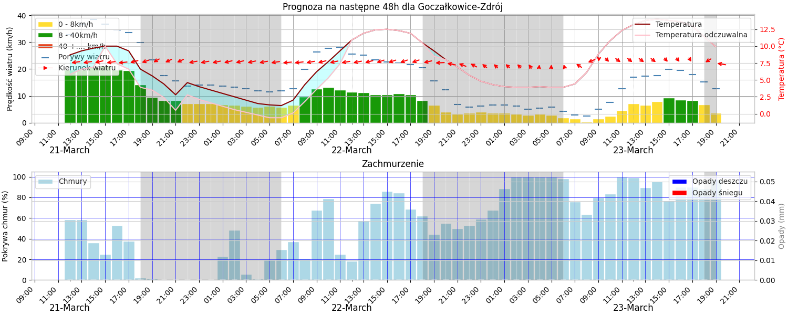

The program is dedicated to windsurfers and kitesufers. It analyzes the weather in a selected location where windsurfing and kitesurfing are practiced.
It works continuously. Several times a day (according to a given schedule) it downloads weather forecast data for a specific location. The program can analyze any location by entering the longitude and latitude. Weather data is downloaded from Visual Crossing Corporation using the Weather Timeline API. Visual Crossing Corporation updates the weather forecast every 6 hours. We download weather data 5 minutes after their update, i.e.: 8:05, 14:05 and 20:05 Polish time. The program analyzes this data. The criteria for selecting weather conditions are configurable, they can be freely adjusted. The program takes into account parameters such as wind speed, wind gusts, wind direction, temperature and precipitation. If the program finds good weather conditions for windsurfing the next day, it will send surfers an e-mail with a notification and a weather chart. If good weather conditions are not until the next day, it will also send notifications with a weather chart, but the message will be different - it will be about the day after tomorrow. The program will only send emails once a day, even if it detects good weather conditions every time the program is launched. Below is an example of a weather chart sent to surfers

License
This project is licensed under **CC BY-NC-ND 4.0**. Copying, using and modifying the code is prohibited without the author's consent.