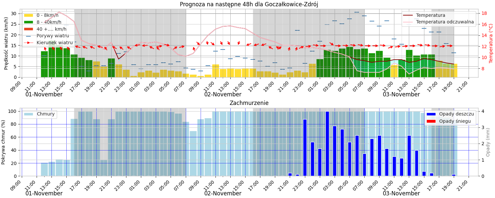

The program is dedicated to windsurfing and kitesurfing enthusiasts. It analyzes the weather forecast in a selected location where windsurfing and kitesurfing is practiced. It works in continuous mode. Several times a day (according to a given schedule) it downloads weather forecast data for a specific location. The program can analyze the weather forecast in any location, providing longitude and latitude. Weather data is downloaded from the US database of Visual Crossing Corporation (Visual Crossing is a leading provider of weather data and enterprise analysis tools to data scientists, business analysts, professionals, and academics) using the Weather Timeline API. Visual Crossing Corporation updates the weather forecast every 6 hours. We download weather data 5 minutes after its update, i.e.: 8:05, 14:05 and 20:05 Polish time (UTC+2 - summer time, or UTC+1 for winter time). The program analyzes this data. The criteria for selecting weather conditions are configurable, they can be freely adjusted. The program takes into account such parameters as wind speed, wind gusts, wind direction, temperature and precipitation. The program can analyze weather conditions in the available time range, i.e. 15 days in advance. Due to possible, unforeseen weather changes, we send notifications about good weather conditions only 2 days in advance. If the program finds good weather conditions for windsurfing the next day, it will send surfers an e-mail with a notification and a weather chart. If good weather conditions do not occur the next day, but the day after, it will also send notifications with a weather chart, but the message will be different - it will concern the day after tomorrow. To protect recipients from too many e-mails, the program sends e-mails only once a day, even if it detects good weather conditions every time the program is launched. Below is an example of a weather chart sent to surfers

Authors of the project
To implement the project, I worked with:
- Łukasz Cichowicz (https://github.com/LCichowicz) - author of all the charts,
- Piotr Nowek (https://github.com/PiotrNowek) - he performed all the tests.

License
This project is licensed under **CC BY-NC-ND 4.0**. Copying, using and modifying the code is prohibited without the author's consent.